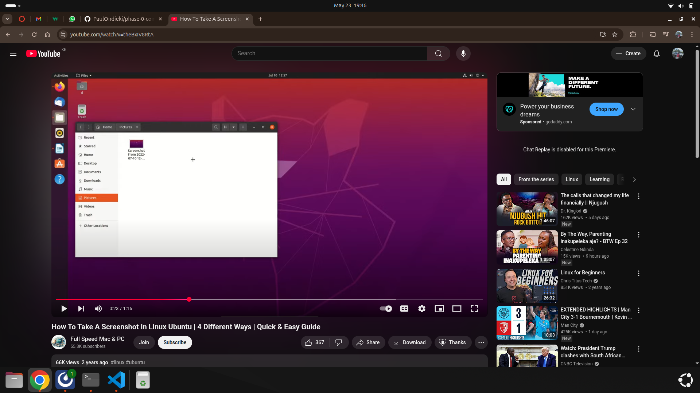

# StudyMate – Personal Productivity & Motivational Dashboard

## 👩‍💻 Author
  PAUL ONDIEKI

---
# Project Presentation

Click the image below to watch the video presentation:

[](https://drive.google.com/file/d/1WCREbaBByiV9AJWqQf6hrEr7PVd9PBip/view?usp=sharing)


## 📖 Project Description

**StudyMate** is a personal productivity and mental wellness dashboard designed specifically for students. Built as a Single Page Application (SPA) using HTML, CSS, and JavaScript, it integrates real-time interactivity with data fetched from public and local APIs.

Many students struggle with staying motivated, managing tasks, and maintaining focus. StudyMate provides an all-in-one space that helps with:

- 🧠 Mental wellness tracking  
- ✅ Smart task management  
- 💡 Daily coding tips with interactive practice  
- 💬 Personalized motivational quotes  
- ⏱ Focus timer using the Pomodoro method  
- 🎨 Customizable themes for better focus and personalization

---

## 🚀 Live Demo

🔗 [Click here to view the live site on GitHub Pages](https://github.com/PaulOndieki/Phase-1-Project.git)

> Replace the link with your actual GitHub Pages deployment URL.

---

## 📂 Project Features

- **Mood Tracker** – Choose how you feel, and receive motivational quotes accordingly
- **Smart To-Do List** – Add, complete, and delete tasks with a real-time progress bar
- **Daily Coding Tips** – Practice coding habits with tips fetched from a local API (json-server)
- **Pomodoro Timer** – 25-minute focus timer to build healthy study habits
- **Theme Customization** – Toggle between light and dark themes
- **Progress Summary** – View your mood and task stats over time (stretch goal)

---

## 🛠 Tech Stack

- **Frontend:** HTML, CSS, JavaScript
- **Data Fetching:** `fetch()` with asynchronous handling using JSON
- **Persistence (Stretch Goal):** `json-server` to simulate backend
- **LocalStorage:** Used for task saving without a backend
- **No frameworks or libraries used** (fully vanilla JS)

---

## 📦 Project Setup Instructions

### 1. Clone the Repository

```bash
git clone https://github.com/PaulOndieki/studymate.git
cd studymate
